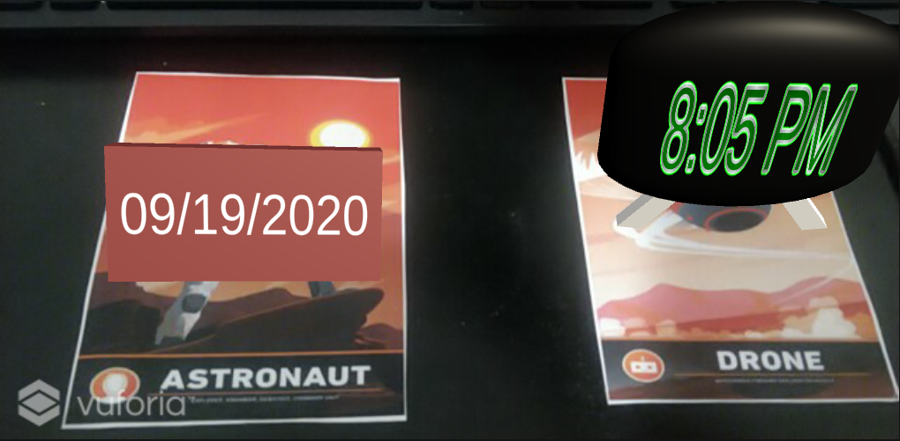
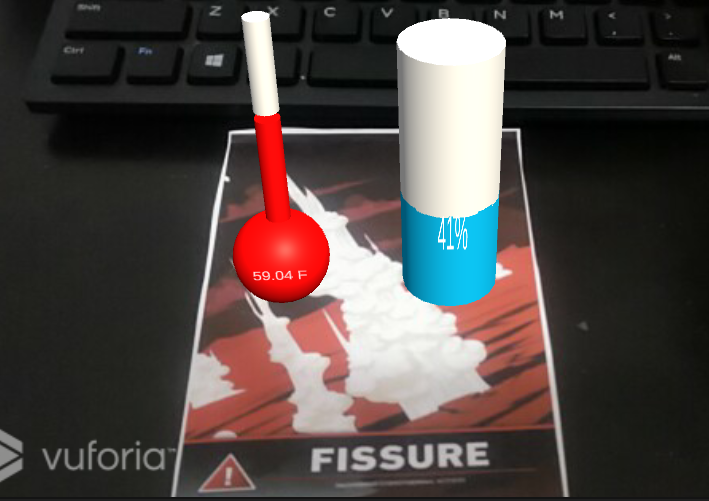

# Widgeting Around

This is a course project (Project 1) for CS 428 - Virtual, Augmented & Mixed Reality at UIC under Professor Andrew Johnson ([course link](https://www.evl.uic.edu/aej/428/)). 

***

### Requirements

* [Unity 2019.4.1f1](https://unity3d.com/get-unity/download)
* [Vuforia 9](https://developer.vuforia.com/downloads/sdk)
* [OpenWeatherMap API Key](https://openweathermap.org/)
* Webcam

### How to run

* Clone the project and open it in Unity
* Click on the ```RequestHandler``` GameObject and enter your OpenWeatherMap API in the ```Api Key``` field. This is required to get data from OpenWeatherMap
* Obtain copies of the following image targets from the Vuforia Mars database - 
  * Astronaut
  * Drone
  * Fissure
  * Oxygen
  * Mars Box - Front
* Connect your webcam as the camera source for Vuforia engine
* Click Play in the Unity editor

### Description

This project is an augmented reality app that displays certain widgets to the user over image targets. The widgets show useful information such as data, time, and weather. The weather data is obtained from OperWeatherMap API and the models are created by me. The list of widgets currently displayed on this app are - 
* Time widget over the Astronaut marker
* Date widget over the Drone marker
* Temperature and humidity widget over the Fissure marker
* Wind speed and direction widget over the Oxygen marker
* Weather condition widget over the Mars Box - Front marker

### Features

* The user can toggle between imperial (default) and metric system for the units using the __U__ key on the keyboard
* The temperature widget is a thermometer that "fills up" according to the current temperature, similar to the humidity widget, which is a beaker containing water according to the percentage of humidity in the air
* The widget displaying wind speed and direction is a flag pole, who's height signifies the speed of the wind and who's flag signifies the direction. The flag is oriented taking the top of the Oxygen marker as North, so make sure that marker lies with it's top pointing North to obtain the accurate direction
* The weather condition widget displays the nine weather conditions as unique models that have a unique looping sound effect. The user can press __space bar__ once the first weather condition is detected to cycle through all the conditions available

### Screenshots

 

__Time and date widget__

 

__Temperature and humidity widget__

### Audio credits

1. Rain - http://soundbible.com/1999-Rain.html - by Pwlae
2. Sunny Day - http://soundbible.com/1661-Sunny-Day.html - by stephan
3. Outdoor Carnival - http://soundbible.com/2139-Outdoor-Carnival.html - by Daniel Simon
4. Distant Thunder and Light Rain - http://soundbible.com/886-Distant-Thunder-And-Light-Rain.html - by Mike Koenig
5. Monsoon - http://soundbible.com/948-Monsoon.html - by Mike Koenig
6. Perfect Thunderstorm - http://soundbible.com/916-Perfect-Thunder-Storm.html - by Mike Koenig
7. Snowing - http://soundbible.com/633-Snowing.html - by Mike Koenig
8. Wind - http://soundbible.com/1810-Wind.html - by Mark DiAngelo
